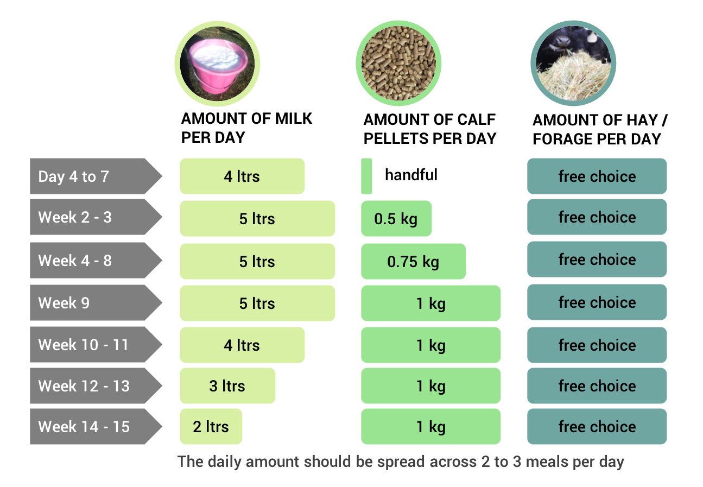
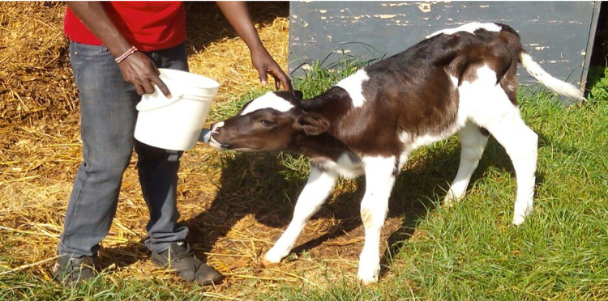

<blockquote style="background: #f2f3f4;">

To add your question press   in bottom corner 👇

</blockquote>

  
Getting the right feeding schedule for your calves is very important. Many people deprive their calves of feed as they want to sell more milk on the market. This may be profitable in the short term, but if you don't feed your calf properly it will never be a high yielding heifer.
  

<blockquote style="background: #D7F19F;">

### Feeding in the first 4 days after birth

The milk that cows produce during the first 3-4 days after calving is called colostrum. Colostrum is different from normal milk as it helps protects calves from diseases and is very high in protein, energy, vitamins and minerals.
  
In an ideal situation, a calf should drink around 4 litres of milk in the first hour after calving. The second feed should be given at least 12 hours after the first. If the calf has drunk 4 litres in its first feed, then 2 litres of colostrum will be ok for the second feed.
  
During the following 3 days the calf should be allowed to drink as much colostrum as it wants. Allow the calf to suckle 3 times a day or bottle/bucket feed 4-5 times a day.

 

  

    Source:
    
    <b>ILRI</b>
    
 <b>21</b>
      
    

  

</blockquote>

<blockquote style="background: #D7F19F;">

### Day 5 to weaning – follow the schedule

The picture below shows a recommended feeding schedule designed by the International Livestock Research Institute (ILRI). The schedule shows the recommended daily amount of milk, pellets and hay to give a calf. This daily amount should be spread across 2 to 3 meals.

</blockquote>

Here is a suggested feeding schedule for late weaning calves:

### Top Q&A from AFC members

William asked a common question about feeding calves...

<blockquote style="background: #6EA6A2;">

  ### William’s Question

  Which is the best method of feeding a new born calf, bucket feeding or allowing it to suck directly?

   

  

    Posted by:
    
    <b>William K</b>
    
 <b>12</b>
      
    

  

</blockquote>

A top answer we've selected comes from Phillip...

<blockquote style="background: #96e58e;">

### Phillip's Answer

Provide it in a bucket that resembles its mothers teats. The posture of giving milk is also important to avoid milk bypassing the abomasum and running into the rumen. This can lead to ruminal bloat which is fatal. Hope some of you have lost calves having a distented stomach or rumen take care!
    

  

    Posted by:
    
    <b>Phillip W</b>
    
 <b>31</b>
      
    

  

</blockquote>

Our AFC opinion on this topic

<blockquote style="background: #D7F19F;">

### AFC opinion

In the first 2-3 days after birth the most important thing is to ensure that calf gets enough milk. Often suckling directly or using a bottle is a good way to do this. After this it is common to use a bucket with a teat attached so you can monitor how much milk is being drunk by the calf.

    

  

    Posted by:
    
    <b>AFC</b>
    
 <b>31</b>
      
    

  

</blockquote>

Edwin experienced a common problem that happens when raising calves...

<blockquote style="background: #6EA6A2;">

  ### Edwin’s Question

  My calf which is almost three weeks is refusing to eat pellets what should I do?? Experts on calf management kindly assist..

   

  

    Posted by:
    
    <b>Edwin N</b>
    
 <b>12</b>
      
    

  

</blockquote>

A top answer we've selected comes from Antony...

<blockquote style="background: #96e58e;">

### Antony's Answer

When giving milk dip pellets in hot water then add to milk. Gradually stop dipping in water and when calf finishes milk throw a handful of pellets in. By then it will start taking solids.

    

  

    Posted by:
    
    <b>Antony N</b>
    
 <b>31</b>
      
    

  

</blockquote>

Got more questions about feeding calves? Add your questions in the comments section below...

---
### Read more topics

If you haven't already then make sure you read the basics of feeding for dairy cows:

* [Feeding your cows - basics](/feeding-your-cow-basics)  ⭐- Start with the basics

...or you can just [see all topics](/)
