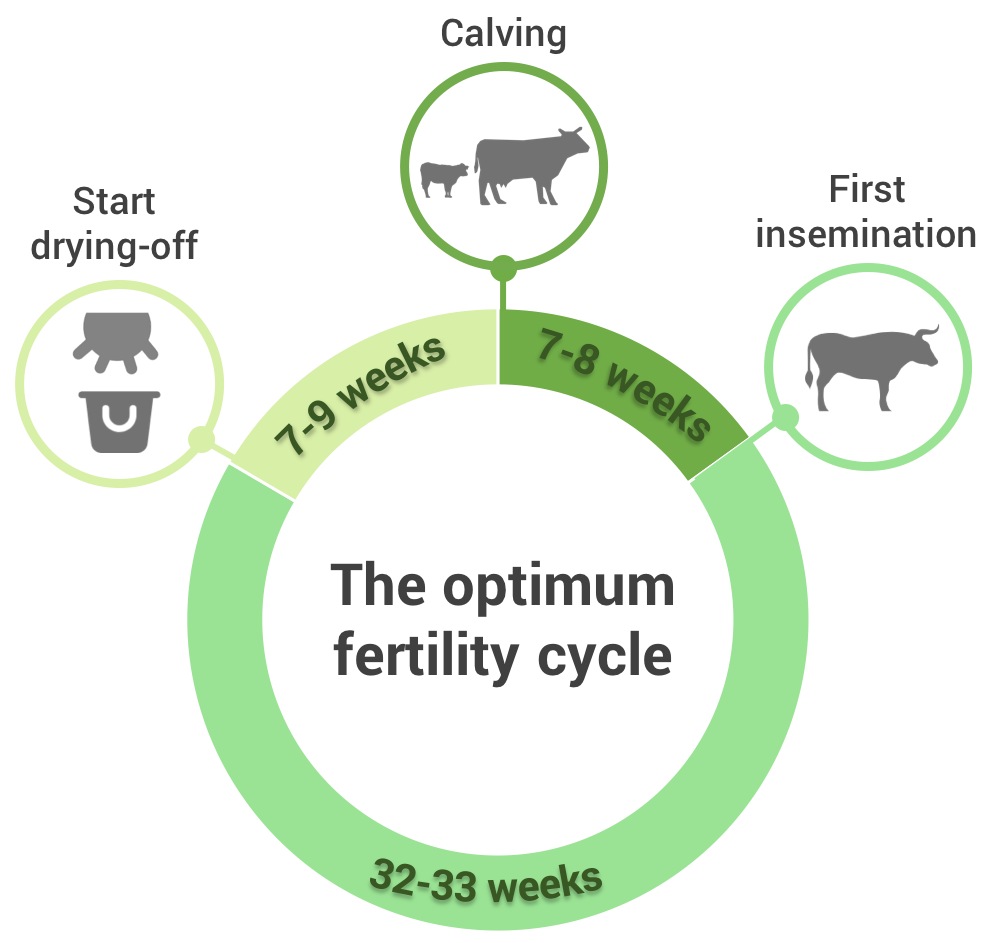

<blockquote style="background: #f2f3f4;">

To add your question press   in bottom corner 👇

</blockquote>

  
Knowing how and when to serve cows is a fundamental part of creating a profitable and sustainable dairy herd. In this guide we give you the basics on everything you need to know.

<blockquote style="background: #D7F19F;">

### The cow fertility cycle

Here are the key dates you need to know:
1. Heifers are ready to be served for the first time at around 15 months of age
2. Cows come on heat every 18-24 days
3. Cows are normally inseminated 50-80 days after calving
4. Pregnancy takes 282 days

Check out the diagram below to see the optimum fertility cycle between calvings for a mature cow.

 

  

    Source:
    
    <b>ILRI</b>
    
 <b>21</b>
      
    

  

</blockquote>

The diagram below shows the optimum fertility cycle for a commercial dairy herd

<blockquote style="background: #D7F19F;">

### Signs of pregnancy

Experts estimate that around half of artificial inseminations fail so it's important to check your cow for signs of pregnancy after it has been served.
  
The most common way to do this is to check whether the cow comes on heat again. The next heat should be about 18-24 days after the last one. If your cow shows signs of heat at this time then it means the AI has probably failed.
  
There are 2 other methods to check for pregnancy:
1. Rectal palpitation - this can be performed by an experienced vet at approximately 45 days after being served. The vet will put his arm into the rectum to feel for signs of pregnancy. The main benefits of this method are that it gives an immediate result and can also be used to check for any signs of problems with the pregnancy.
2. Pregnancy test - recently pregnancy test kits have become available in many agrovets. This is a good option if there are no skilled vets available.

 

  

    Source:
    
    <b>ILRI</b>
    
 <b>21</b>
      
    

  

</blockquote>

### Top Q&A from AFC members

<blockquote style="background: #6EA6A2;">

  ### Lilian's Question

  help me friends,my cow shows signs of heat,but when served she doesn't become pregnant.what could be the problem.

   

  

    Posted by:
    
    <b>Lilian</b>
    
 <b>12</b>
      
    

  

</blockquote>

<blockquote style="background: #96e58e;">

### Makula Dairy's Answer

How many times has it been served without getting pregnant? Normally when a cow is on heat in the morning you serve it in the evening and when you see it in the evening it should be served the following morning. What usually happens it may come on heat in the evening but you only see it the following morning, in that that case if you serve in the evening you will have missed it.
  
Some times the inseminator may fail to find the cervix and he/she is not going to tell you that she could not find the cervix chances are the cow may not concive. Another thing the inseminator may be walking around with bad semen. An experience inseminator should be able to detect mature follicles on the ovary. 
  
Now from the last time it was on heat count 18 days and watch it day and night fot the next 6 days because the cycle is between 18 to 24 days. By the fact that it is coming on heat that is a good sign that it is cycling. On my farm i have cows that concive on the first serving and I have those which concive after 2, 3 sometimes 4 servings. I have cows that give me only heifers and I have cows that give me only steers and those that alternate.
  

  

    Posted by:
    
    <b>Makula Dairy</b>
    
 <b>31</b>
      
    

  

</blockquote>

Our AFC opinion on this topic

<blockquote style="background: #D7F19F;">

### AFC opinion

There are also some other factors that affect a cow's fertility.
  
1. Body condition - if a cow is too thin her fertility will be reduced. Cows need to have enough energy and protein in the diet to get pregnant and have a healthy calf.
2. Heifer maturity - normally heifers are ready to be served for the first time at 15 months of age. But remember that if your heifer is underweight then it will not have reached maturity at this time. The target weight for a Friesian heifer at 15 months is 300-350kg and the target weight for a Jersey is 250-275kg.
  
If your cow is in good condition and is not conceiving after 2 or 3 inseminations then get a vet to check if the cow has any health issues. If there are no health issues then the cow may be infertile / low fertility - in this case you may sadly have to dispose of it as it will be uneconomical to keep it.

  

    Posted by:
    
    <b>AFC</b>
    
 <b>31</b>
      
    

  

</blockquote>

### Real Farmer Experiences

<blockquote style="background: #96e58e;">

  

  
  

    

  I have been given this information from the AI. How do I interpret this?
    
  

    Posted by:
    
    <b>Julius L</b>
    
 <b>49</b>
      
    

  

</blockquote>

<blockquote style="background: #96e58e;">

### Halbe's Advice

Good choice when I look at production: + 1000 liter, and slightly negative in fat and protein. Fat and protein is not important in Kenya, since you are only paid by liters, so you need bulls which get many more liters. The % fat and protein can go down.
  
When your cows are small now, there is a risk of birth problems. All bulls have also a figure for "easyness of birth". I think that is the most important factor for your animals. Use bulls which are good for heifers. 
  
I like big cows, for they can produce a lot of milk, but only if they are fed well and not given stovers straw, stalks and matured hay. With a low production you can better have small cows, for their maintenance need is lower. Remember you need 1 kg dm (of good quality) for every 100 kg of bodyweight).
  

  

    Posted by:
    
    <b>Halbe K</b>
    
 <b>31</b>
      
    

  

</blockquote>

Got more questions about serving cows? Add your questions in the comments section below...

---
### Read more topics
There are number of other important topics in this guide:

* [Feeding your calf](/feeding-calf) ⭐ - The best way to feed for a healthy calf
* [Feeding your cows - basics](/feeding-your-cow-basics)  ⭐ - Understand the basics of feeding
* [Signs of a cow on heat](/signs-for-a-cow-on-heat)  ⭐ - How to know if your cow is on heat

...or you can just [see all topics](/)
