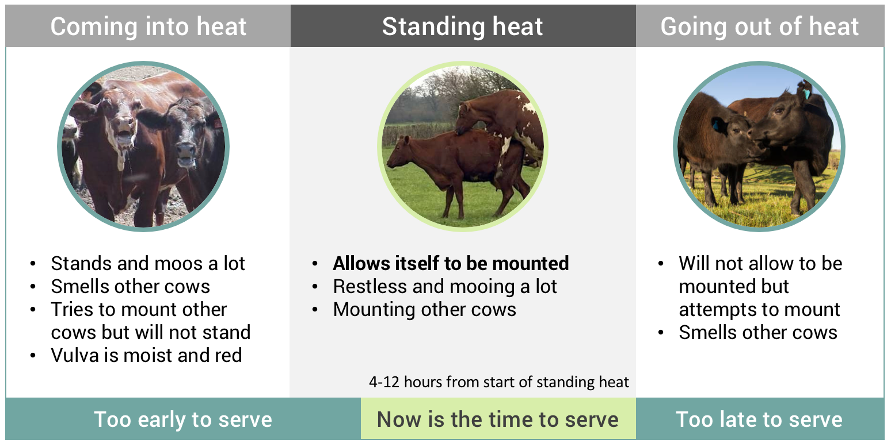

<blockquote style="background: #f2f3f4;">

To add your question press   in bottom corner 👇

</blockquote>

  
One of the most common reasons for failed inseminations in cows is farmers missing the signs of heat. Here we discuss what you need to look out for and when...
  

<blockquote style="background: #D7F19F;">

### The basics

A cow coming on heat means that she is ready to be served. The best time to inseminate a cow is between 4 and 12 hours after the first signs of heat. This means you need to observe the cow carefully to know when the first signs appear. If you miss the first signs then you may inseminate too late and the cow will fail to conceive.
  
The average length of heat is about 14 hours in normal weather conditions but it can be as short as 2 hours. It's important that you check your cows twice a day to catch short heats. The best time to observe is in the morning and evening as those are the most common times for a cow to come on heat.

 

  

    Source:
    
    <b>ILRI</b>
    
 <b>21</b>
      
    

  

</blockquote>

The diagram below shows the stages of heat for dairy cows. The best time to inseminate your cow is 4 to 12 hours after the first signs of standing heat...

<blockquote style="background: #D7F19F;">

### What causes silent heat?

Silent heat is when your cow is going through heat but shows no signs. This is a problem that is reported frequently by dairy farmers. There are a number of reasons why your cow may not show signs:
1. Poor housing - cows must have enough space to allow cow-to-cow interaction to show heat
2. Hard floor -  cows dislike being mounted while standing on hard or slippery surfaces (e.g. concrete) and prefer softer surfaces (e.g. grass, dirt, straw). Evidence suggests that mounting is reduced by 50% when cows are standing on concrete.
3. Feet and leg problems - cows that are weak or with painful feet and legs are less likely to mount other cows. Such cows may allow themselves to be mounted when not in heat because it is too painful to run away.
4. Social reasons - heifers that are in a low position in the herd may not try to mount other cows.

The best way to deal with silent heat is to monitor your cows very carefully as there may be small signs (e.g. smelling other cows) that are easily missed. Another option is to introduce a "teaser bull" to the cow - the bull will always know if the cow is on heat and will try and serve her.
  
Once you know when the cow is on heat then it's important to keep good records. The cow will come on heat every 21 days so you should know when the cow is ready to be served without having to see the signs of heat.

  

  

    Source:
    
    <b>ILRI</b>
    
 <b>21</b>
      
    

  

</blockquote>

  

---
### Read more topics
There are number of other important topics in this guide:

* [Feeding your calf](/feeding-calf) ⭐ - The best way to feed for a healthy calf
* [Feeding your cows - basics](/feeding-your-cow-basics)  ⭐ - Understand the basics of feeding
* [When to serve and AI](/when-to-serve-and-ai)  ⭐ - Knowing when how and when to serve

...or you can just [see all topics](/)
