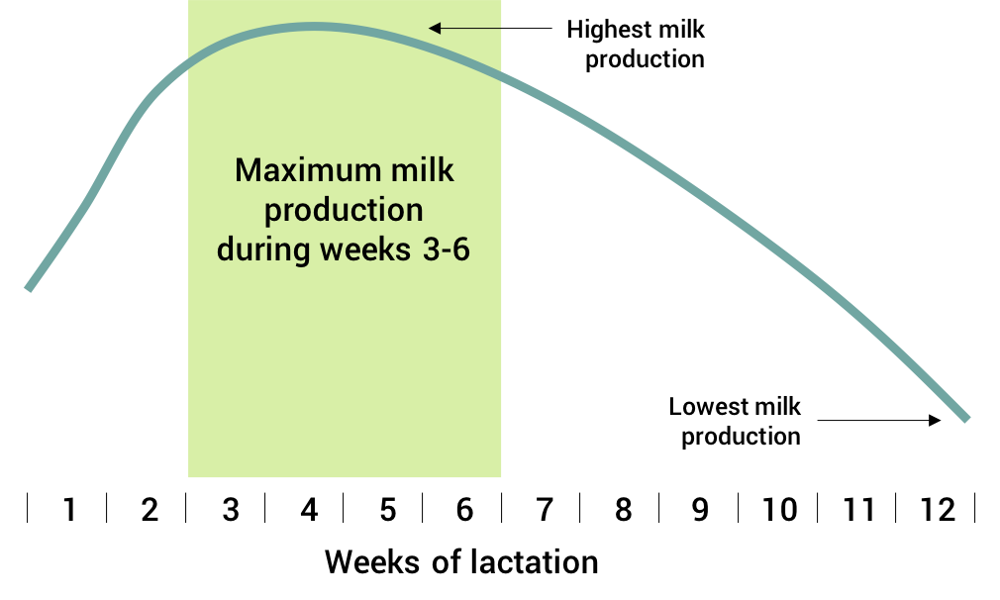
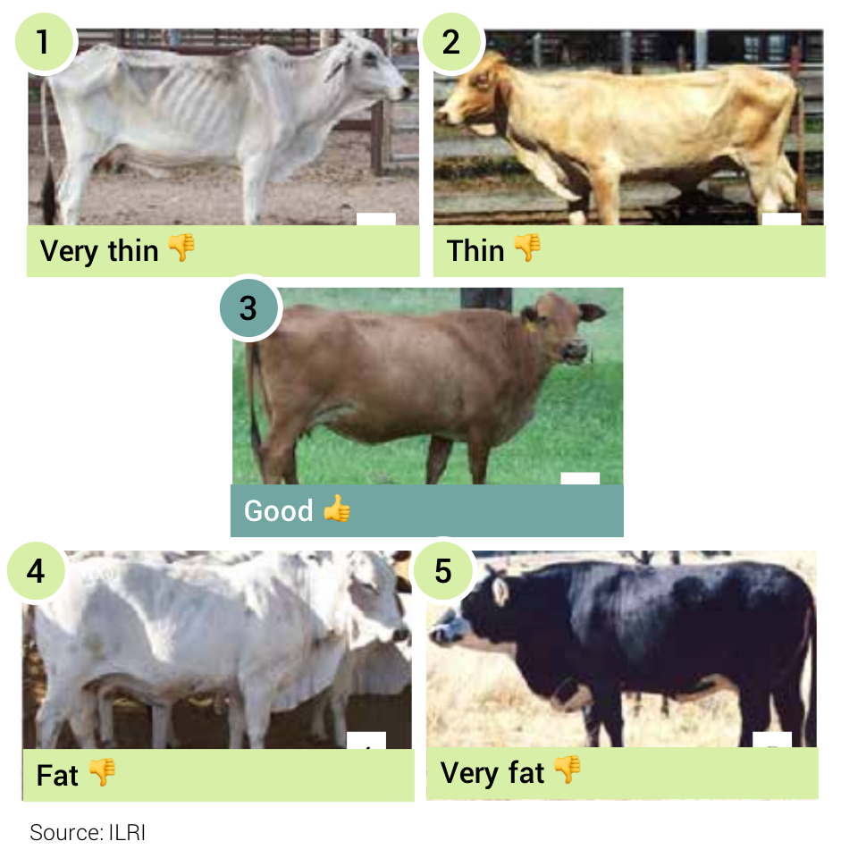
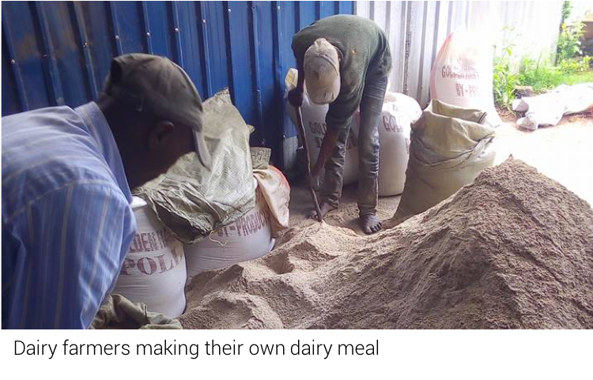

<blockquote style="background: #f2f3f4;">

To add your question press   in bottom corner 👇

</blockquote>

  
Welcome to part 1 of our guide on how to increase milk production. "How can I increase production?" is one of the most common questions for dairy farmers. So let's start with the basics. Firstly, the amount of milk production with vary depending on the number of weeks after calving. You can see the chart below to see that the peak milk production time is normally weeks 3 to 6 of lactation. 
  

  

There are a number of different reasons why your cow might not be producing a good amount of milk. In this guide we'll talk about 3 of them...

<blockquote style="background: #D7F19F;">

### Reason 1 – NOT ENOUGH ENERGY

The most common reason for low milk production is not enough energy. Firstly, check the pictures below to see whether your cow has the right body condition. At pre-calving stage your cow should ideally look like number 3. If your cow looks more like number 1 or 2 then it has not received enough feed and does not have enough energy for high milk production.
  

  

    Source:
    
    <b>ILRI</b>
    
 <b>21</b>
      
    

  

</blockquote>

Check your cow against these examples...

Paul asked a question about body condition...

<blockquote style="background: #6EA6A2;">

  ### Paul's Question

  My family cows are huge (fat for lack of a better word). My question is, can this affect milk production, fertility or general well being of the cows?

   

  

    Posted by:
    
    <b>Paul W</b>
    
 <b>12</b>
      
    

  

</blockquote>

<blockquote style="background: #D7F19F;">

### AFC opinion

Yes it can. There are a two main reasons why cows shouldn’t be too fat.
  
1. If cows are too fat at the end of their current lactation then there is a risk that they won’t feed enough at the beginning of the next lactation. This can lead to low milk production in the next lactation.
  
2. Cows that are too fat at calving are more likely to have difficult births, retained placenta, milk fever or ketosis.
  

  

    Posted by:
    
    <b>AFC</b>
    
 <b>31</b>
      
    

  

</blockquote>

The second most common reason for cows not producing enough milk is not enough protein in the diet. It's really important that you control the amount of protein in the diet during steaming up and lactation.

<blockquote style="background: #D7F19F;">

### Reason 2 – NOT ENOUGH PROTEIN

Milking cows need sufficient protein (concentrates) in their diet to produce good amounts of milk. Here are 2 popular feeding methods to ensure cows get enough concentrates.
  
<b>1. Challenge feeding</b> 
Start by feeding your cow 4kg of concentrates (e.g. dairy meal) per day. Increase the amount by 0.5 - 1 kg per day as long as the there is an increase in milk production. When the milk production stops increasing then stop increasing the amount of concentrates. When the milk production starts dropping then reduce the amount of concentrate gradually.
  
<b>2. Re-allocation feeding</b> 
Give 8 kg concentrates per day for the first 12 weeks of lactation and then give good quality forage only for the rest of the lactation. If the cow is not already accustomed to concentrates then start off with only 2 kg and increase gradually over the first week to 8 kg.

  

  

    Source:
    
    <b>ILRI</b>
    
 <b>21</b>
      
    

  

</blockquote>

A third reason for low milk production is easily missed by dairy farmers...

<blockquote style="background: #D7F19F;">

### Reason 3 – NOT ENOUGH WATER

Don’t forget that around 90% of milk is water! A lactating cow can drink up to 120 litres of water per day. Make sure your cow has access to as much good, clean water as she can drink or you will see a reduction in milk production.

  

  

    Source:
    
    <b>ILRI</b>
    
 <b>21</b>
      
    

  

</blockquote>

It's important to remember that you need to balance your input costs with the amount you will receive for milk. There's little point in providing lots of extra energy and protein in the diet if you cannot cover your feed costs with your milk sales...

<blockquote style="background: #6EA6A2;">

  ### Mudenyo's Question

  Hae farmers, I need a business plan on milk production

   

  

    Posted by:
    
    <b>Mudenyo B</b>
    
 <b>12</b>
      
    

  

</blockquote>

<blockquote style="background: #D7F19F;">

### AFC opinion

To make sure your dairy operation is profitable you need to calculate the amount you are spending on feed vs. the amount you are getting in milk sales. It's difficult to give a "one-size-fits-all" business plan as it will differ for every dairy farmer depending on their ability access to feed and the quality of their cow.
  
Normally the most expensive part of increasing milk production is the buying of concentrates (e.g. dairy meal). A good rule is that a 1kg increase in concentrates per day should result in an increase in of milk of 1.5 to 2 litres per day. So ask yourself three questions to determine your profitability:
 
1. What is the cost of 1kg of concentrates?
2. If I give my cow 1kg extra concentrates per day - how much extra milk do I get per day?
3. Is the price of the extra concentrates lower than the sale price of the extra milk?
 

Don't forget that there are ways to save costs on feed. Commercial dairy meal is often expensive and sometimes low quality. Often making your own dairy meal at the farm is cheaper than buying commercial dairy meal.
  

  

    Posted by:
    
    <b>AFC</b>
    
 <b>31</b>
      
    

  

</blockquote>

---
### Read more topics
This is part 1 of our guide on how to increase milk production. Check out part 2 where we talk about other factors that might affect production such as mastitis, poor housing and lack of minerals.

* [Increasing milk production part 2](/preventing-and-treating-milk-fever) ⭐ - Part 2 of our guide
* [Feeding your cows - basics](/feeding-your-cow-basics)  ⭐- Understand the basics of feeding
* [Feeding milking cows](/feeding-milking-cows)  🔒- Know best feeds for milking cows

...or you can just [see all topics](/)
