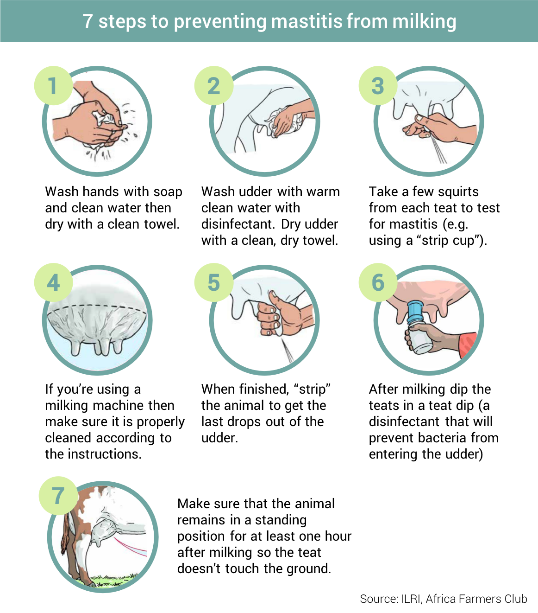
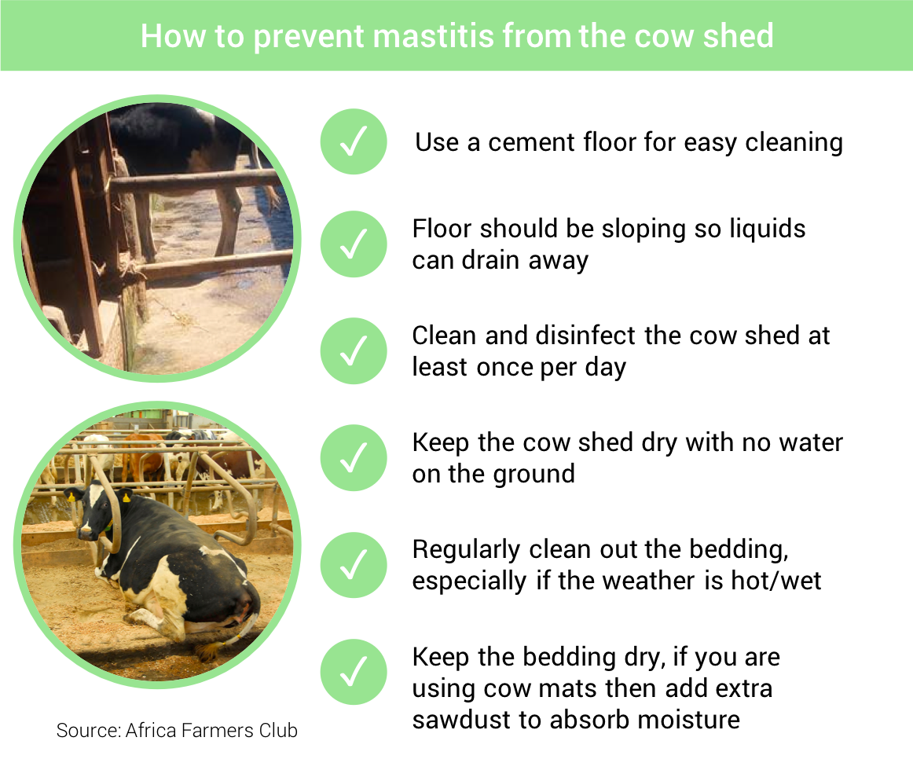

<blockquote style="background: #f2f3f4;">

To add your question press   in bottom corner 👇

</blockquote>

  
Mastitis is one of the most common problems experienced by dairy farmers. Mastitis is an inflammation of the udder and is normally caused by bacteria getting inside the teat. 
  
In minor cases mastitis will reduce the litres of milk produced and result in poor quality milk. In very serious cases mastitis can cause cow death.

<blockquote style="background: #D7F19F;">

### What causes mastitis?

Mastitis is normally caused by poor milking practices or cows being housed in unclean environments. If your cow has not been fed properly or is stressed then she will be more susceptible to mastitis as she will find it harder to fight the infection.

 

  

    Source:
    
    <b>ILRI</b>
    
 <b>21</b>
      
    

  

</blockquote>

Check out our 7 steps to preventing mastitis when milking...

Check out our 6 steps to preventing mastitis from the cowshed...

### Top Q&A from AFC members

<blockquote style="background: #6EA6A2;">

  ### Wycliffe's Question

  Hi farmers. How do we test for mastitis?!

   

  

    Posted by:
    
    <b>Wycliffe O</b>
    
 <b>12</b>
      
    

  

</blockquote>

Our AFC opinion on this topic

<blockquote style="background: #D7F19F;">

### AFC opinion

Signs of mastitis include the udder looking swollen, hard or red. Before you milk the cow you should check the milk from each teat to make sure it is not watery or with clots/flakes/pus. These are signs of mastitis.
  
Some farmers regularly test their cows using the California Mastitis Test (CMT) which you can buy from your local agrovet. This is a good idea if you multiple cows and you think they may be at risk.
  

  

    Posted by:
    
    <b>AFC</b>
    
 <b>31</b>
      
    

  

</blockquote>

<blockquote style="background: #6EA6A2;">

  ### Beatrice’s Question

  Can someone advise me on how to treat mastitis on dairy cow?

   

  

    Posted by:
    
    <b>Beatrice K</b>
    
 <b>12</b>
      
    

  

</blockquote>

Our AFC opinion on this topic

<blockquote style="background: #D7F19F;">

### AFC opinion

If your cow has mastitis it is really important that you get her checked by a vet as the type of treatment will depend on the type of infection. It’s impossible to know what type of infection she has without getting tested.
  
One way to help your cow recover is by milking regularly. Empty the infected teat every 3 hours and your cow will recover more quickly.
  

  

    Posted by:
    
    <b>AFC</b>
    
 <b>31</b>
      
    

  

</blockquote>

### Real Farmer Stories

Dan's experience with Milk fever...

<blockquote style="background: #96e58e;">

  

  
  

 

  "DARKEST day in dairy farming is when one of your best dam, just after patiently waiting for it to calf, and you are expecting over 30 litres production, disaster structs. She is attacked by a severe case of mastitis and succumbs less than 72 hours after giving birth! Luckily you remain with a beautiful 46kg female calf to remember her with eventhough you even don't have colostrum to feed her with. The kipsigis people used to say that "one should not prepare a calabash for storing milk before the cow calfs" Anything can and will happen. Am experiencing a worst sense of loss in my entire dairy farming life."

 
  
    

  

    Posted by:
    
    <b>Dan K</b>
    
 <b>49</b>
      
    

  

</blockquote>

Got more questions about mastitis? Add your questions in the comments section below...

---
### Read more topics
There are number of other important topics in this guide:

* [Feeding your cow - Basics](/feeding-your-cow-basics) ⭐ - How to get started with feeding
* [Preventing and Managing Bloat in Cows](/preventing-and-managing-bloat)  ⭐- Know what to look out for

...or you can just [see all topics](/)
