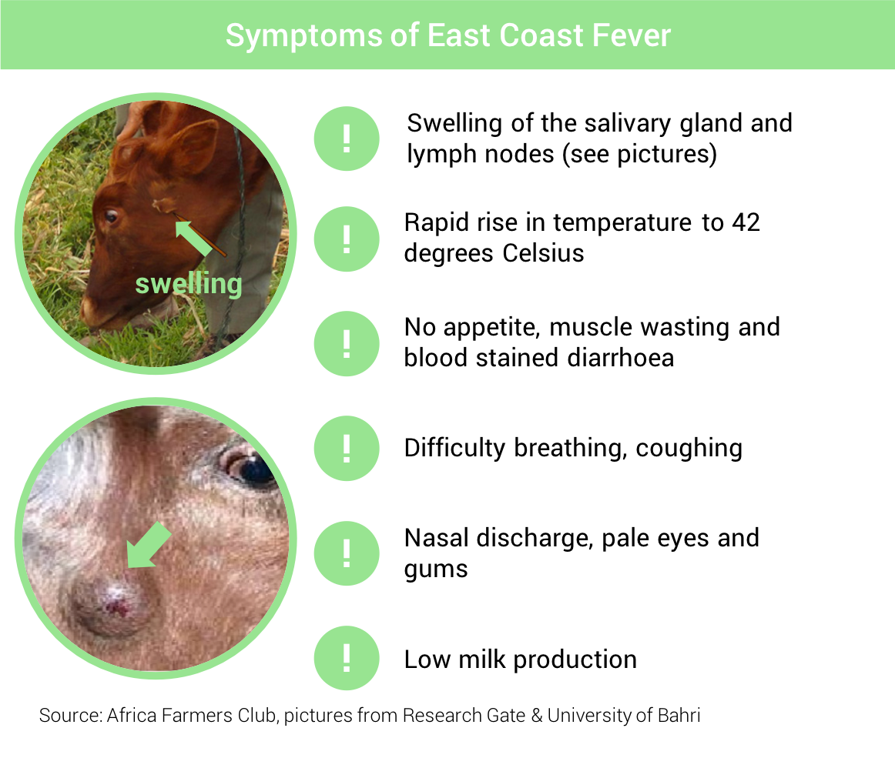
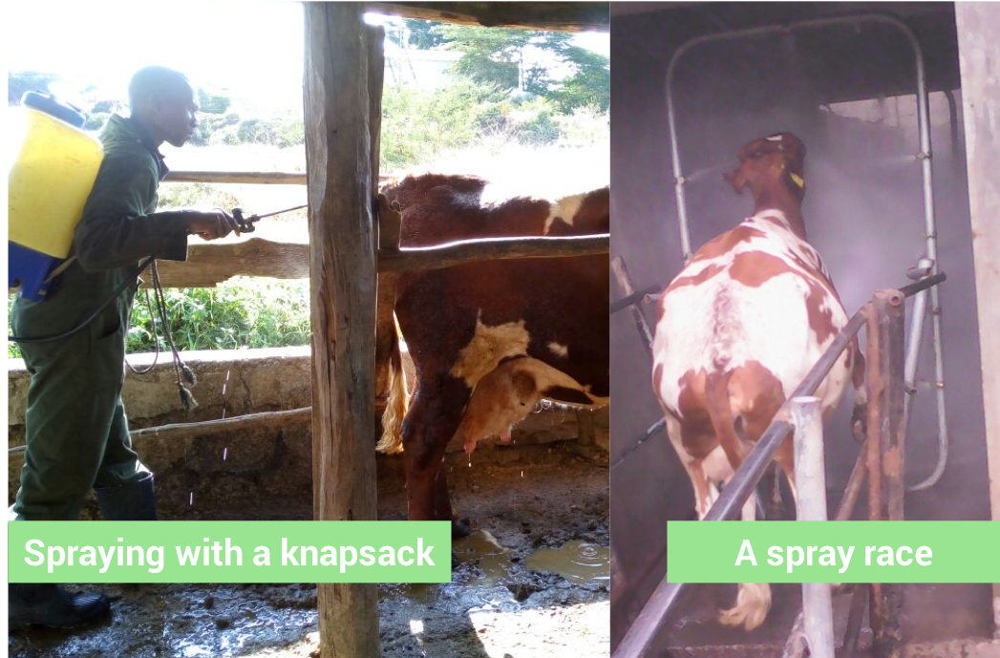

<blockquote style="background: #f2f3f4;">

To add your question press   in bottom corner 👇

</blockquote>

  
As of 1992 East Coast fever was called probably the most important livestock disease of cattle, sheep and goats in Africa, causing an annual loss of 1.1 million cattle and $168 million in 1992...
  

<blockquote style="background: #D7F19F;">

### What causes East Coast Fever?

East Coast Fever is transmitted to cows by the “brown ear tick”. It is called this because the ticks normally attach themselves to the cow’s ear. 
  
If you see symptoms of East Coast Fever you must call a vet immediately as cows can die within 3 weeks. There is now a vaccination available to protect cows from the disease.

 

  

    Source:
    
    <b>ILRI</b>
    
 <b>21</b>
      
    

  

</blockquote>

Check out our 6 signs to watch out for...

<blockquote style="background: #D7F19F;">

### Where can I get the vaccine?

The vaccination currently costs 1000 Ksh for dairy cattle and 700 Ksh for beef cattle.
  
Make sure you buy the vaccine from a registered organisation:
 
<b>Sidai Africa:</b> Dr Rezin Odede (0722628472)
 
<b>VetAid:</b> Dr Mpilei David (0725330278), Dr Gabriel Turasha (0721473926)
 
<b>BMC/Agrihaus:</b> Dr Rawlynce Bett (0726681441)
 
<b>KDFF:</b> Mr David Bett (0725799246)

 

  

    Source:
    
    <b>ILRI</b>
    
 <b>21</b>
      
    

  

</blockquote>

### Top Q&A from AFC members

Josephat asked a common question about ECF vaccinations...

<blockquote style="background: #6EA6A2;">

  ### Josephat's Question

  I've witnessed a number of animals coming down with ECF despite having been vaccinated against the same. Any expert on this?

   

  

    Posted by:
    
    <b>Josephat W</b>
    
 <b>12</b>
      
    

  

</blockquote>

<blockquote style="background: #96e58e;">

### David's Answer

It depends with the strain of parasite in the area.n should take in account that introduction of new stock,or wild life or mixing with other animals may result in your cow acquiring a different kind of parasite other than you vaccinated, its advisable to continually washing with accaricide once a week to kill the life cycle of such ticks and avoid mixing new stock immediately you purchase
  

  

    Posted by:
    
    <b>Davidkariuki</b>
    
 <b>31</b>
      
    

  

</blockquote>

<blockquote style="background: #D7F19F;">

### AFC opinion

ECF vaccination will only protect your cattle from one strain of ECF so it is possible for cows to be infected by other strains. 
  
There are also reports of farmers doing the vaccinations themselves (without a trained vet) or buying the vaccination from people who are not registered. If the vaccination is not stored properly and administered properly then the animal will not be protected and could become very sick.
  

  

    Posted by:
    
    <b>AFC</b>
    
 <b>31</b>
      
    

  

</blockquote>

Judy was looking for more information on the best way to spray against ticks...

<blockquote style="background: #6EA6A2;">

  ### Judy’s Question

  My calf has a lot of ticks which is the best to to spray pliz advice

   

  

    Posted by:
    
    <b>Judy W</b>
    
 <b>12</b>
      
    

  

</blockquote>

<blockquote style="background: #96e58e;">

### Gordon's Answer

Go to an agrovet shop,buy DUO DIP. At home if washing 1 cow,take a Knapsack spray,clean thorough with soapy water to clear any pesticide used before. Pour clean water 2.5 litres into the Knapsack,measure Dupdip 5ml and pour into the Knapsack. Mix thoroughly,then add 2.5 litre of water into the Knapsack then mix thoroughly. If the cow is muddy wash it and allow water to drain. Now spray very all over,the ears,between hooves.thereafter spray the sleeping area and dogs if around.
  
READ THE LABEL OF THE ACARICIDE YOU HAVE BOUGHT!

 

  

    Posted by:
    
    <b>Gordon A</b>
    
 <b>31</b>
      
    

  

</blockquote>

<blockquote style="background: #D7F19F;">

### AFC opinion

Regular spraying of acaricides will help to control ticks. If your calf has a lot of ticks then start by spraying 2-3 times per week. You can reduce to 1 spray per week once you see the ticks reduce. Remember that ticks can become resistant to some sprays so you may need to try different brands to see what is most effective.
  
Make sure that the pasture around your calf isn’t overgrown and bushy as this can spread ticks. Also make sure the calf isn’t coming into contact with other animals such as dogs.
  

  

    Posted by:
    
    <b>AFC</b>
    
 <b>31</b>
      
    

  

</blockquote>

Got more questions about East Coast Fever? Add your questions in the comments section below...

---
### Read more topics
There are number of other important topics in this guide:

* [Preventing and treating milk fever](/preventing-and-treating-milk-fever) ⭐ - Guidance on milk fever issues
* [Feeding your cows - basics](/feeding-your-cow-basics)  ⭐- Understand the basics of feeding
* [Feeding milking cows](/feeding-milking-cows)  🔒- Know best feeds for milking cows

...or you can just [see all topics](/)
